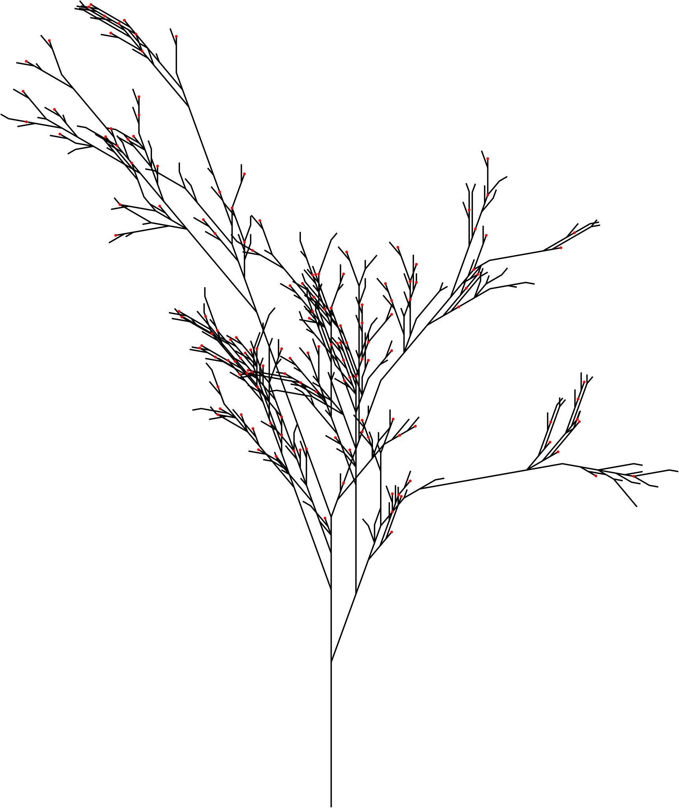

# ulsys
"Micro" LSys. A small Python 3+ library for evaluating Lindenmayer-systems, with a small accompanying turtle implementation for pretty drawings.

ULSYS IS VERY MUCH PRE-ALPHA RIGHT NOW AND THE INTERFACE WILL LIKELY CHANGE A LOT.

## Current status
- [X] Reasonable Turtle API
- [X] PyX Turtle Backend
- [X] Very simple Tikz (LaTeX) Turtle Backend
- [X] PoC Simple L-System implementation
- [X] Package partitioned after L-System type
- [X] Stochastic L-System support
- [ ] Interopability with Python stdlib turtle package

## Goals 
These are the desired goals with the library. ulsys is not an attempt to write the most performant, most feature complete L-System evaluator, at least for now. But it strives to be simple to use and good enough for most scenarios.

### Primary goals
- Very simple to use and get running.
- Evaluating simple Lindenmayer systems (non-stochastic, non-parametric)
- A small Turtle implementation that easily supports different backends
- Easy to read code, to serve as an example implementation of an L-System evaluator.
- At least one vector graphics Turtle backend

### Secondary goals
- Performance
- Support for stochastic Lindenmayer systems

# Examples


Use the included "Tri" Koch Snowflake and the PyX library turtle to create an
SVG file:

```python
import ulsys
from ulsys import standard
from ulsys import turtle

t = turtle.PyXTurtle()

syms = ulsys.triKochFlake(4)
actions = ulsys.triKochFlake.turtleActions

turtle.mapActions(syms, actions, t)

from pyx import canvas, path, style
c = canvas.canvas()
c.stroke(path.path(*t.paths), [style.linewidth(0.15)])

with open("test.svg", "wb") as f:
    c.writeSVGfile(f)
```

A stochastic L-System example, that generates a decently realistic plant branch.

```python
import ulsys
from ulsys import stochastic
from ulsys import turtle

t = turtle.PyXTurtle()

syms = stochastic.evaluateSystem(
    "X",
    stochastic.production("X 0.25->F-[[X]+X]+F[+FX]-X", "F->FF", "X 0.25->F+[[XX]+X]-F[-FX]-X", "X 0.5->F[X[FX]]+F[[FX]X]"),
    6)
actions = ulsys.fractalPlant.turtleActions

turtle.mapActions(syms, actions, t)

from pyx import canvas, path, style
c = canvas.canvas()
c.stroke(path.path(*t.paths), [style.linewidth(0.15)])

with open("test.svg", "wb") as f:
    c.writeSVGfile(f)
```

Here's a more advanced example with a custom TurtleAction that calls `circle` 
which adds a circle of a given radius to the PyXTurtle.circle list whenever
an "A" is encountered. It creates branches like above, but with the seed fixed
over several generations to simulate growth. The circles ends up at certain
leaf nodes.



```python
import ulsys
from ulsys import stochastic
from ulsys import turtle
from ulsys.turtle import TurtleAction
import math

import random

seed = random.random()

for n in range(1, 6):

    random.seed(seed)
        
    t = turtle.PyXTurtle()
    
    CircleAction = TurtleAction("circle", [0.15])
    
    syms = stochastic.evaluateSystem(
        "X",
        stochastic.production("X 0.25->F-[[X]+X]+F[+FX]-X", "F->FF", "A->F", "X 0.25->F+[[XX]+X]-F[-FX]-X", "X 0.5->F[X[FXA]]+F[[FX]X]"),
        n)
    turtleActions = {
        "F":TurtleAction.forward(),
        "-":TurtleAction.rotate(-math.pi / 9),
        "+":TurtleAction.rotate( math.pi / 9),
        "[":TurtleAction.push(),
        "]":TurtleAction.pop(),
        "A":CircleAction
    }
    
    turtle.mapActions(syms, turtleActions, t)
    
    from pyx import canvas, path, style, deco, color
    c = canvas.canvas()
    c.stroke(path.path(*t.paths), [style.linewidth(0.15)])
    for circle in t.circles:    
        c.fill(circle, attrs=[deco.filled([color.rgb.red])])
    
    with open("test{}.svg".format(n), "wb") as f:
        c.writeSVGfile(f)
```

## Platform
Python 3+

## License
MIT license. 
